# Phemex puzzle clues

A place to collect and compile official clues, proposed solutions and
relevant information in one place. Feel free to contribute.

PS: Send BTC donations at [33SBrHNRc6cWREvL9K34T999iEGtRDAWnd](https://www.blockchain.com/btc/address/33SBrHNRc6cWREvL9K34T999iEGtRDAWnd) or ETH at [0x6ed8e1bdaf753df9a699edaea8e9c2acc194dd0b](https://www.blockchain.com/eth/address/0x6ed8E1Bdaf753DF9A699eDaea8E9c2AcC194DD0B) to support my beer fund.

<!-- START doctoc generated TOC please keep comment here to allow auto update -->
<!-- DON'T EDIT THIS SECTION, INSTEAD RE-RUN doctoc TO UPDATE -->

- [Summary](#summary)
- [Official articles](#official-articles)
- [Possible hints given on telegram](#possible-hints-given-on-telegram)
- [Appendix 1 - Telegram screenshots](#appendix-1---telegram-screenshots)

<!-- END doctoc generated TOC please keep comment here to allow auto update -->

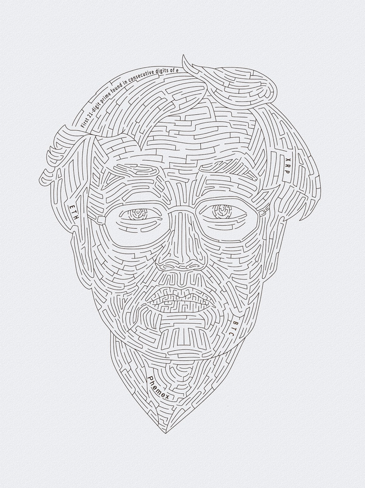

## Summary

- Address is [1h8BNZkhsPiu6EKazP19WkGxDw3jHf9aT](https://www.blockchain.com/btc/address/1h8BNZkhsPiu6EKazP19WkGxDw3jHf9aT)

- The compressed public key is `02b4a72e4aaa69ba04b80c6891df01f50d191a65eccc61e4e9862d1e421ce815b3`.
- 21 digit prime is `957496696762772407663`.
- Some words from the image need to be converted into a 27-digit decimal
  number.
- The solution consists in 3 steps:
  1. Finding the 21-digit prime
  2. Converting some words from the image into a 27-digit decimal number.
  3. This step is not known yet but is probably a function of the numbers found in steps 1 and 2 to generate a private key.
- The 27-digit number does not start with and probably doesn't contain the
  21-digit number (since Max claimed he could only recognize the
  2-leading digits easily).
- List of wrong 27-digit numbers: all numbers that start with `3`, `11`, `27`, `21` or `22`, plus all following numbers: `292369552859534997735785456`, `110671209768548944980739847`, `102334351591489987809745256`, `148305288324511300566909296`, `102334351593652704433055345`, `148305288328731020224972481`. `109315479387323682257496938` `732214536553841474496141447`, `961414474147445365538732214`, `536553896141447732214414744`, `414744536553896141447732214`, `773307574967642777994775797`, `947757974277795749676773307`, `574967694775797773307427779`, `427779574967694775797773307`, `452561023343515914899878097`, `452561023341489987809735159`, `452563515910233414899878097`, `452563515914899878097102334`, `452561489987809710233435159`, `452561489987809735159102334`, `140715953831866323726367136`, `523682311121192242318221112`, `140715953831866323726367136`, `102334452563515914899878097`, `212426137135032177995282192`. Since Max claimed to not have seen the right first 2-digits at that point, we can probably exclude all numbers whose first 2-digits match one of the listed previous numbers.
- Puzzle is solvable without hints.
- Capitalization of words in puzzle matters.
- 27-digit number is not necessarily a prime.
- 27-digit number doesn't involve consecutive digits of `e`.
- Max's birthday, username, etc. are not relevant.
- Only Max knows the private key but both Jack and Cecilia (chief marketing) know the
  method.

## Official articles

- [Puzzle announcement article](https://phemex.com/references/articles/try-to-solve-our-2-btc-puzzle#the-public-key-is-1h8bnzkhspiu6ekazp19wkgxdw3jhf9at)
  - Possible clue that private key is derived using [bip32](https://github.com/bitcoin/bips/blob/master/bip-0032.mediawiki) scheme: "Through this game we want to educate users on the importance of private key custody and safety. We have built our own, innovative **Hierarchical Deterministic** Cold **Wallet** System, which assigns an independent deposit address to each user so that all assets are kept in cold wallets."
  - The Bitcoin address is [1h8BNZkhsPiu6EKazP19WkGxDw3jHf9aT](https://www.blockchain.com/btc/address/1h8BNZkhsPiu6EKazP19WkGxDw3jHf9aT) (note: it is incorrectly referred to as a public key in the article).
- [A letter from Max (27 digit clue)](https://phemex.com/references/articles/a-letter-from-max)
  - "The first 21-digit prime found in consecutive digits of e is: 957496696762772407663
    - Already known
  - "The private key you derive from Satoshi’s portrait is a big integer, not Wallet Import Format (WIF)"
    - Seems self-evident since WIF is just a copy/paste friendly encoding of a private key.
  - "The filename of the picture is irrelevant"
  - "The next step involves converting some words from the portrait, without I/O, into a 27-digit number"
    - 27-digit decimal number is too small to be the output of a hash
      function so we can probalby exclude their use for generating the
      number.
    - I/O possibly refers to [Input/Output](https://en.wikipedia.org/wiki/Input/output) which could be a
      synonym for communication with the outside world (e.g. the puzzle is solvable without
      additional information found on the web).
    - I/O possibly refers to the fact that [base58 encoding](https://en.wikipedia.org/wiki/Base58) excludes the letters `I`, `O`, `l`, and `0`.
    
- [The Last Hint of Phemex 2.1BTC Puzzle](https://phemex.com/references/articles/the-last-hint-of-phemex-2-1btc-puzzle)
  - "After meeting the Phemex team, the Goddess Pheme repeated the words “little is big”, twice within three days."
  - "We believe this hint is the best way to reward those of you that have continued to work hard on the Puzzle."

## Possible hints given on telegram

In chronological order:

- Max told Cr0wn_Gh0ul he was in the right direction after saying he
  tried all permutations of `['957496696762772407663', 'BTC', 'ETH', 'XRP', 'Phemex']` with caps, no-caps, abbreviated, etc.
- Max said Paul was in the right direction after he said "we should find
  a way to convert BTC, XRP, ETH and Phemex to numbers. This was later
  confirmed in official hint article.
- Jack (Phemex co-founder) said that Max promised him the puzzle would take at least one year to
  solve, so it might not be as easy as Max is insinuating.
- Max said to "get inspiration from Google hiring ads". He later acknowledged
  that this just referred to step 1 of the puzzle (finding the 21 digit
  prime).
- Max re-iterated "some of you are in the right direction" to which Jack
  (Phemex co-founder) replied "some of you are in the wrong direction.
  come on Max, they need more hints!".
- Max said "Paul is good, you are in correct direction" after Paul
  proposed a new approach based on Google's hiring ad `WWWDOT - GOOGLE = DOTCOM`. For example, he proposed to solve `ETH + XRP + BTC = Phemex`.
  That being said, Max later said that the Google inspiration hint was
  only related to step 1.
- Max said: "3 step, Prime is first step"
- Max said: "Don't kill me when I announce solution". This might hint to
  the fact that the solution might be considered either "dumb" or
  "impossible to guess" by some, or maybe Max was just teasing.
- Max confirmed that the number 21 (21 digits, 2.1 BTC prize) was chosen
  to pay respect to Bitcoin's 21M supply limit.
- Jack said "Max and I knew nothing about crypto 3 years ago".
- Max said that Jean and Noxvn impressed him after they discussed sha256 and brainwallet.
- Max confirmed that the puzzle was not solvable with "pen and paper"
  only.
- "A letter from max" was published, which confirms that words need to
  be converted into a 27 digit number.
- Max said the following 27-digit numbers are wrong: `292369552859534997735785456`, `110671209768548944980739847`.
- Max confirmed the 27 digit refers to decimal digits.
- Max confirmed that the private key can't be found from transaction data.
- Max said the following 27-digit numbers are wrong:
  `102334351591489987809745256`, `148305288324511300566909296`,
  `102334351593652704433055345`, `148305288328731020224972481`.
- Max said whether the 27-digit number is a prime "doesn't matter".
- Max said the 27-digit number does not start with `3`.
- Max said he only remembers the leading 2 digits of the number.
- Max confirmed that "capital letters matter". Therefore, the solution
  probably doesn't involve transforming the case of the words.
- Max said the following 27-digit number is wrong: `109315479387323682257496938`
- Max said the following 27-digit numbers are wrong:
  `732214536553841474496141447`, `961414474147445365538732214`,
  `536553896141447732214414744`, `414744536553896141447732214`,
  `773307574967642777994775797`, `947757974277795749676773307`,
  `574967694775797773307427779`, `427779574967694775797773307`,
  `452561023343515914899878097`, `452561023341489987809735159`,
  `452563515910233414899878097`, `452563515914899878097102334`,
  `452561489987809710233435159`, `452561489987809735159102334`,
  `140715953831866323726367136`.
- Max said the following 27-digit number is wrong:
  `523682311121192242318221112`.
- Max claimed that lot of people "tried in the right direction, but
  didnt try hard enough" and that "the correct solution has been
  discussed again and again".
- Max said that "Oli, Paul and Cr0wn" are good candidates for leading
  puzzle solving efforts. This possibly means that at least one of them
  was working in the right direction.
- Max confirmed that there is no intermediary step in this puzzle that
  confirms you are progressing in the right direction. You either solve
  it entirely and win or don't.
- Max said "What if the clue is self-proven? When you get it, you will
  understand.". I believe he was just re-iterating what he said
  previously.
- Max asked "You guys can think about why i can easily remember the
  first 2 digits?". This possibly means that the first 2 digits are easy
  to remember for some reason (repeated digits, digits have some
  meaning to him, etc.).
- Max said that in the beginning he thought the puzzle would be solved
  rapidly but now doubts that it will ever get solved. This possibly
  means that earlier approaches were more in the "right direction" or it
  could just mean that he may have underestimated the difficulty of the
  puzzle.
- Max said the following 27-digit number is wrong: `140715953831866323726367136`.
- Max claimed he remembers the first 2 digits but can only verify the
  27-digit number on an offline server. Since the typical reason for
  having an "offline server" is to host a cold wallet, it's possible
  that the solution to the puzzle uses the same HD wallet system that
  they use (with different seed of course).
- Max said the following 27-digit numbers are wrong `102334452563515914899878097`, `212426137135032177995282192`.
- Max said first 2 digits are not `11`.
- Max said first 2 digits are not `21`.
- Max said first 2 digits are not `27`.
- Max replied affirmatively to "Will we know we have the correct 27digit number if we find it?".
- Max confirmed that the puzzle is solvable without hints (e.g. without Max's
  telegram username).
- Max confirmed his date of birth is not relevant.
- Max claimed none of the 27-digit numbers he has seen so far start with
  the correct 2 digits.
- Max confirmed that the 27-digit number doesn't start with `0`.
- Max said that the 27-digit number doesn't still involve consecutive
  digits of `e`.
- Max claims that after solution is revealed, he will be able to prove
  some people were really close through screenshots of Telegram
  discussions.

Possible clues from Jack Tao (co-founder):

- Claimed only Max knows the private key but both Cecilia (chief
  marketing) and himself know the method.
- Confirmed they don't post misleading information.
- Said the maze was designed by an artist (this was revealed as part of a joke so maybe not true).
- Said programming skills is required to solve, also said that
  programmers have a bit of an advantage.
  
Possible clues from Cecilia (admin):
- Answer to what is required to solve this puzzle:
  Cecilia, [17 Jan 2020 at 11:41:27]:
  "You need to be familiar with cryptography, advanced mathematics and programming, hahaha
  not easy to get 2.1btc..."

## Appendix 1 - Telegram screenshots

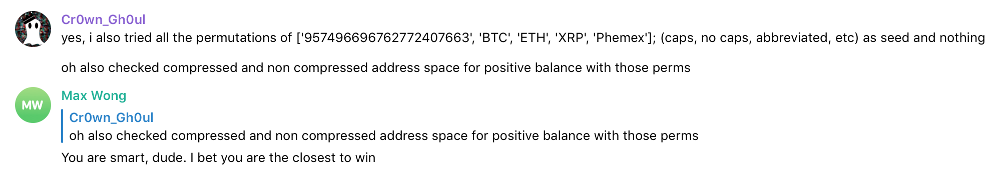

---

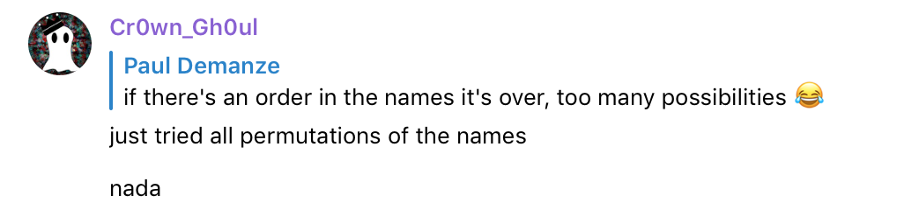

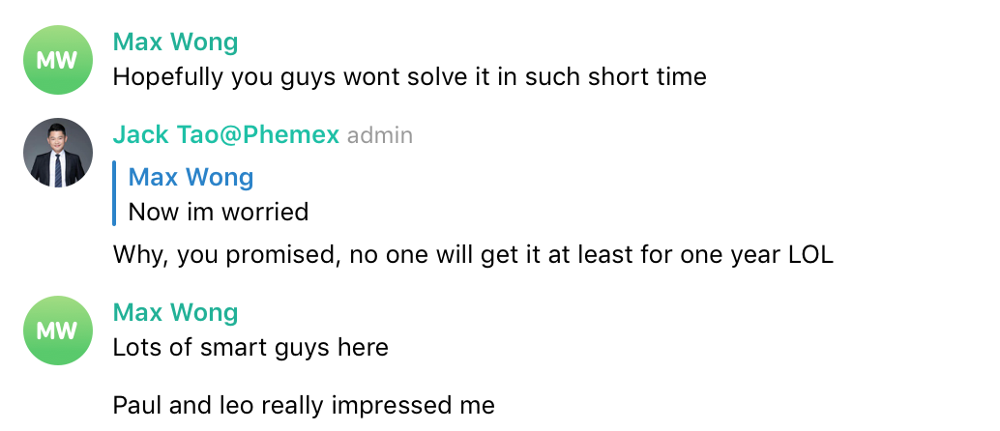

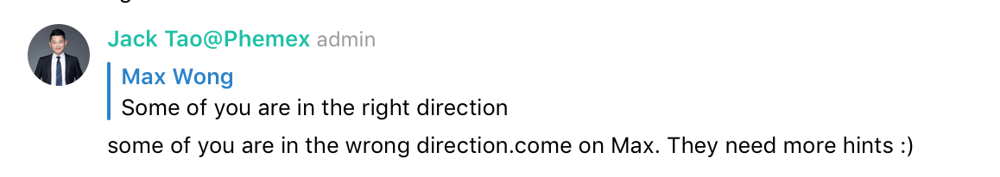

---

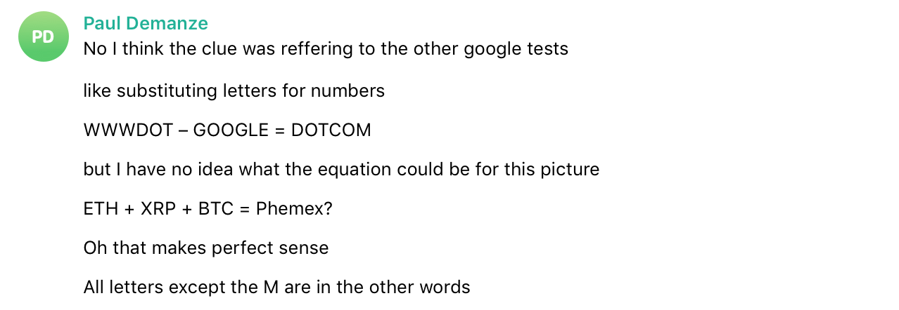

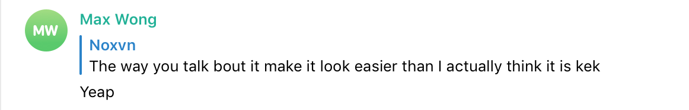
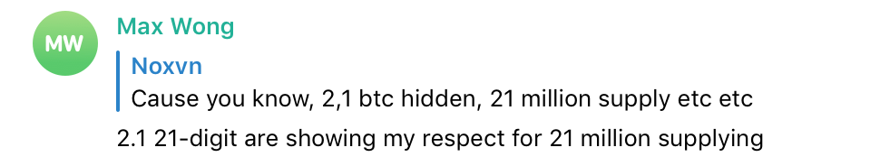

---

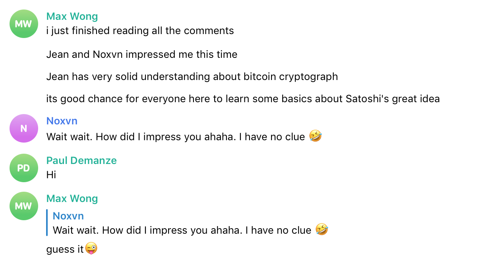
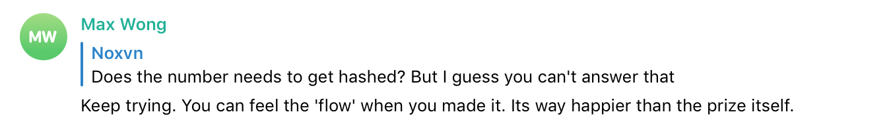

---

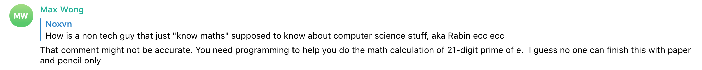
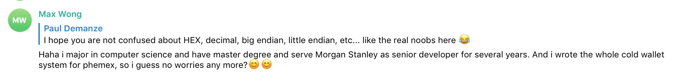

---

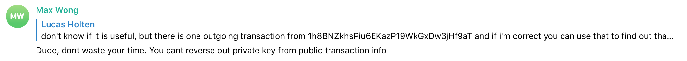
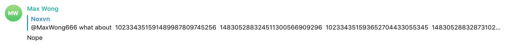
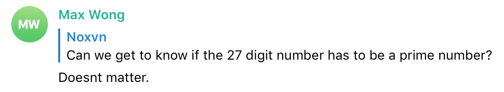
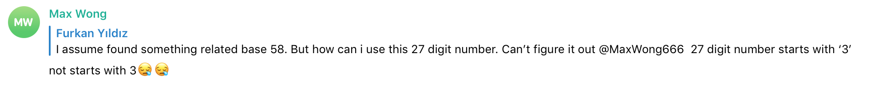

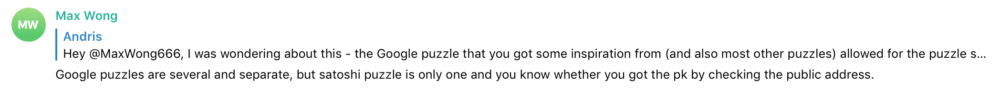

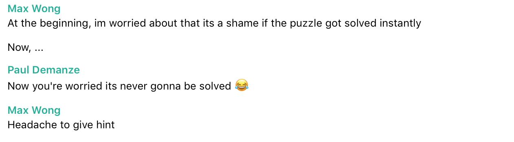
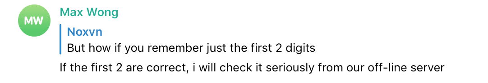

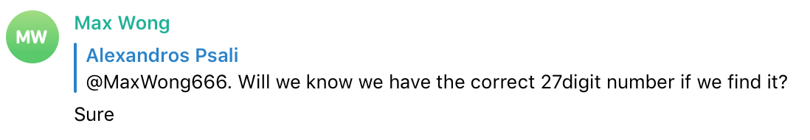
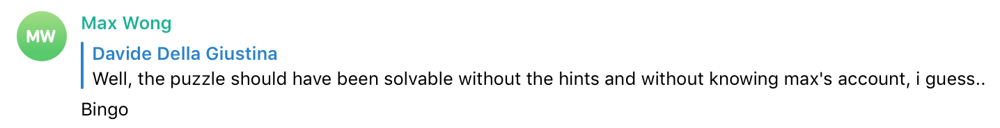
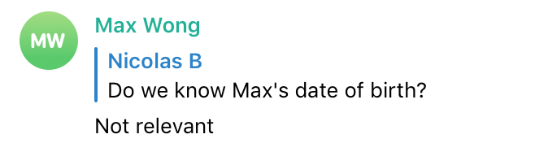

---

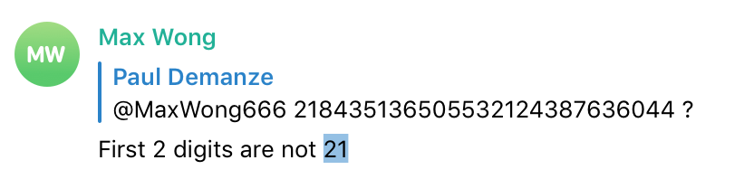
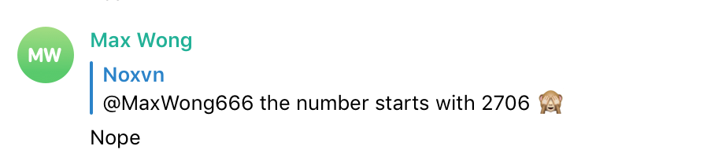
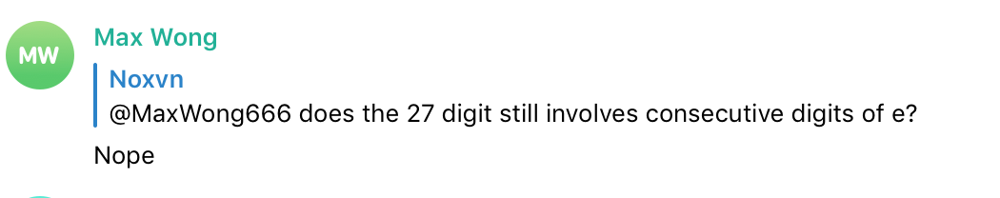

---

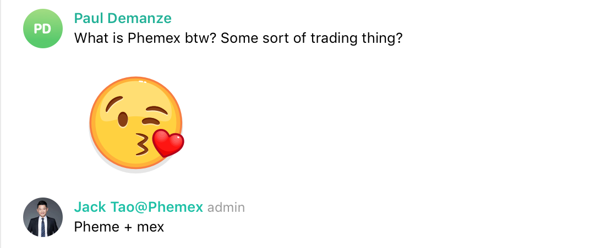

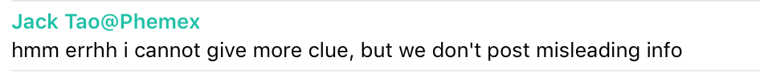
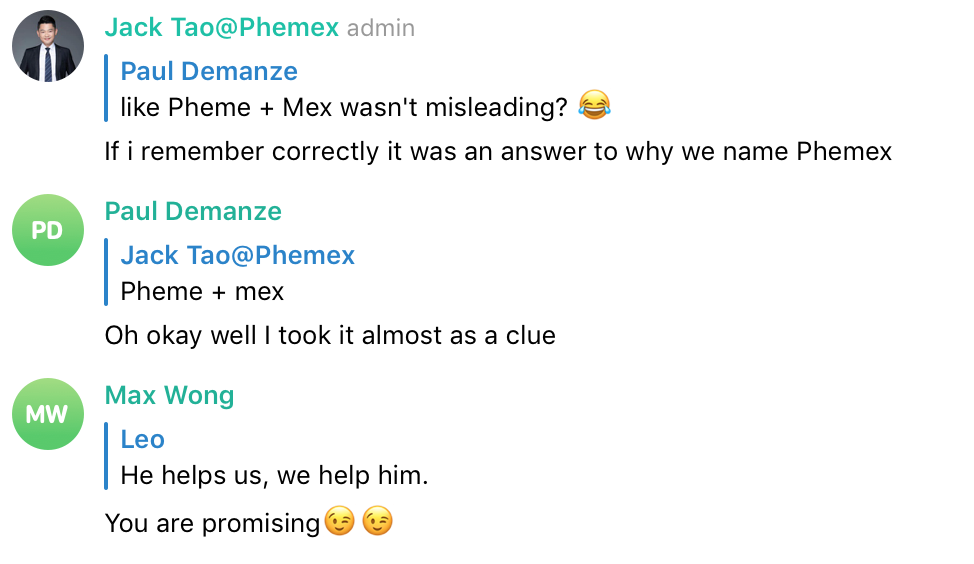
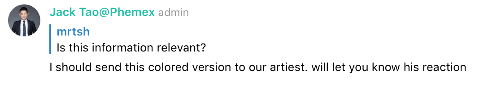

